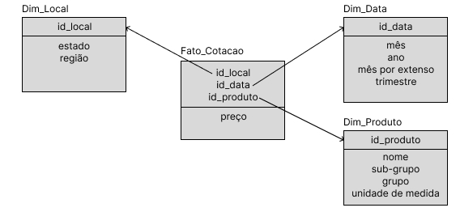

# 🌾🚜 Data Warehouse de Insumos Agropecuários 🌱🌿

Este repositório contém o projeto final da disciplina de Novas Tecnologias em Banco de Dados, realizado por Mateus Matsuo (@mateusmatsuo) e Pedro Correia (@PedroGCorreia), em que foi construído um data warehouse focado em insumos agrícolas. Durante o desenvolvimento do trabalho, a equipe realizou as seguintes tarefas:

* Modelagem do DW e estruturação das consultas;
* Webscraping do site da [Conab](https://consultaweb.conab.gov.br/consultas/consultaInsumo.do?method=acaoCarregarConsulta);
* ETL com os dados obtidos;
* Realização das consultas e análise dos seus resultados;

## Estrutura do projeto

* 🗄️ dataset/: contém dois arquivos .csv gerados ao longo da implementação;
    * insumos_agropecuarios.csv – Dados extraídos diretamente via web scraping;
    * insumos_agropecuarios_tratados.csv – Dados resultantes após o tratamento e limpeza.
* 📝 scripts/: contém os scripts em SQL utilizados para criar e utilizar o Data Warehouse;
    * DDL.sql - Script para criação de tabelas do DW;
    * consultas.sql – Script com as consultas realizadas.
* 📝 main.ipynb - Noteook que demostra os processos de webscraping, ETL dos dados e análise das consultas;
* 💾 dw_backup.sql – Backup completo do data warehouse;
* ⚙️ requirements.txt – Lista de dependências necessárias para execução do projeto;
* 📚 README.md - documentação do projeto.

## Etapas do projeto

1. Modelagem e estruturação das consultas:
* Neste momento, foi projetado o seguinte modelo para implementação nas fases posteriores.



* Além disso, foram pensadas as quatro consultas abaixo para serem rodadas no DW.

    * Análise dos preços ao longo de determinado período de tempo;
    * Comparação dos preços do produto por região;
    * Identificação da produção em um determinado local;
    * Variações dos preços de acordo com o tipo de produto.

2. Webscraping dos dados: extração de dados da página web utilizando as técnicas demonstradas no `main.ipynb`.

3. ETL dos dados: após a extração na fase 2, os dados foram tratados aplicando a transformação de tipos de atributos, criação da coluna região a partir do estado, elaboração de mapeamento entre atributos (trimestre e mês) e definição de estratégia para o tratamento dos valores nulos e, então, houve a carga do DW com o resultado das operações;

4. Realização das consultas e análise dos seus resultados: as consultas foram executadas dentro do postgreSQL por meio do arquivo `consultas.sql` e os resultados dessas queries foram analisados por meio do notebook.

## ⚙️ Como executar o projeto
1. Clone o repositório:
```
git clone https://github.com/PedroGCorreia/Data-Warehouse.git
cd Data-Warehouse
```

2. Configure o ambiente:
* Certifique-se de ter o Python instalado na sua máquina;
* Instale as dependências necessárias com o seguinte comando.
```
pip install -r requirements.txt
```

3. Abra o arquivo `main.ipynb` e execute as células até a finalização da etapa ETL;

4. Execute o script `DDL.sql` (localizado na pasta de scripts) para criar as tabelas do DW e retorne para o `main.ipynb` para realizar a integração com o postgreSQL e realizar a carga do banco com os dados tratados;

* OBS.: lembre-se de alterar a célula de conexão com o postgreSQL para preecher com os dados de usuário, senha, host, porta da conexão e nome do DW corretamente.

5. Realize as consultas SQL por meio do arquivo `consultas.sql` dentro do postgreSQL para verificar os seus resultados;

6. Por fim, retorne para o `main.ipynb` e execute a última seção com a análise das consultas executadas.

* OBS.: os arquivos da pasta dataset e o backup do banco podem ser utilizados para poupar passos desse processo, contudo sugerimos que a execução ocorra dessa forma para melhor compreensão do projeto como um todo.

## Considerações finais

Este projeto demonstra uma aplicação prática acerca de banco de dados, desde a modelagem até a análise dos dados em um ambiente de Data Warehouse, além de demonstrar o conhecimento em diferentes linguagens e ferramentas como Python, SQL e PostgreSQL.